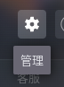
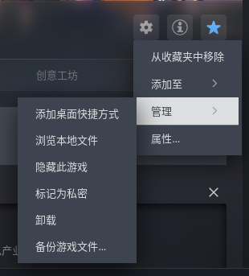
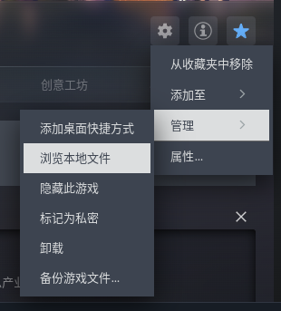
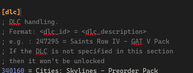

本文主要介绍如何自定义都市天际线的 CreamAPI 补丁来自定义 DLC.
<!--more-->

本教程基于 QQ 群 143395035 (下简称Q群) 中打包的 DLC 补丁，即`群文件/关于DLC/Steam版天际线DLC补丁 2024.10.24.7z`。

!!! question EPIC?
由于Q群和我都主要是 Steam 平台，因此本教程不面向 EPIC 版游戏。
!!!

## 准备工作

1. 从 Q 群群文件下载补丁，然后解压，根据需求选择是否解锁电台打开对应文件夹，此目录被定义为**补丁目录**。

2. 打开游戏目录：

在游戏主页点击`管理`，然后移到`管理`，在弹出菜单中选择`浏览本地文件`：





此目录被定义为**游戏目录**。

3. 打开文件后缀名显示。

4. 阅读随补丁压缩包附带的权责声明，由于不遵循权责声明导致的纠纷，本教程概不负责。

## 补丁安装

### 重命名原文件

将**游戏目录**内的 `steam_api64.dll` 重命名为 `steam_api64_o.dll`，将 `steam_api32.dll` 重命名为 `steam_api32_o.dll`，以上两个文件只会存在一个，根据实际情况重命名。

> [!note]
> 如果你不确定自己打的文件名是否正确，请复制根据实际情况复制以下文件名其中之一：
> ```
> steam_api64.dll
> ```
> ```
> steam_api32.dll
> ```

### 复制文件

将**补丁目录**中的 `steam_api64.dll`(或 `steam_api32.dll`，根据上一步中出现的文件选择) 复制到**游戏目录**，如果提示冲突，说明你上一步没有完成。

将**补丁目录**中的 `cream_api.ini` 复制到**游戏目录**。

> 如果你没有看到 `cream_api.ini` 而是 `cream_api`，说明你没有打开文件后缀名显示。

## 测试

从 Steam 启动都市：天际线，查看左侧 DLC 安装情况，如果你使用的是全解锁(非无电台)，那应该全部是绿色对钩（已解锁）。

## 自定义启用的 DLC

打开**游戏目录**下的 `cream_api.ini`。

下滑，找到 `[dlc]` 小节。



自介绍文段后的 `%ID% = %Label%` 列表就是我们需要修改的。其中 `%Label%` 是对应 DLC 的名字。

找出你不想要的 DLC，在最前面加 `;` 或 `#` 将其注释。本示例关闭了 `Rail Hawk Radio` 和 `Sunny Breeze Radio`。

```ini
1196100 = SteamDB Unknown App 1196100 (Cities: Skylines - Cookies Linux)
1531470 = Cities: Skylines - Content Creator Pack: Train Stations
1531471 = Cities: Skylines - Content Creator Pack: Bridges & Piers
# 1531472 = Cities: Skylines - Rail Hawk Radio
# 1531473 = Cities: Skylines - Sunny Breeze Radio
1726380 = Cities: Skylines - Airports
1726381 = Cities: Skylines - Content Creator Pack: Vehicles of the World
1726382 = Cities: Skylines - Content Creator Pack: Map Pack
```

!!! tip 符号
一定要用半角符号注释。如果你不确定，请复制这个 `#`。
!!!

修改完成后，保存并重新进入游戏。此时不想要的 DLC 已经被关闭。