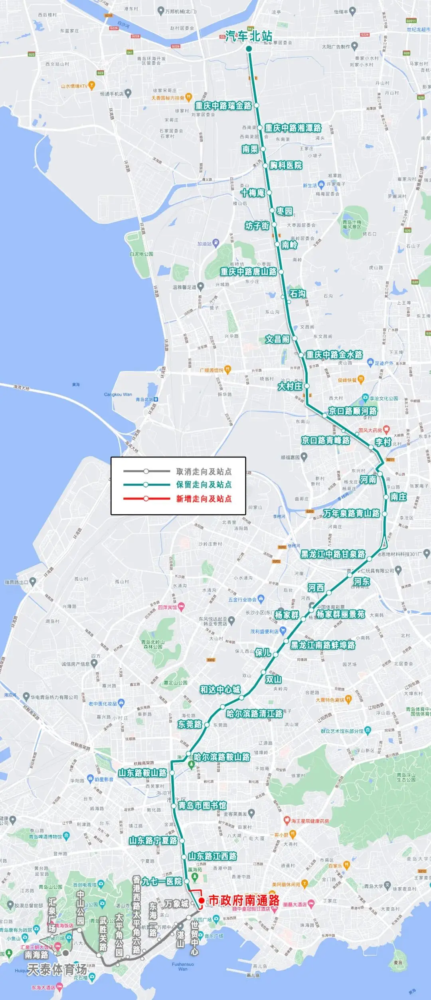

依据《青岛市常规公交与轨道交通衔接导则》《公共汽电车线网设置和调整规则》确立的技术标准，为进一步优化市区公交运力配置，减少与地铁3号线的竞
争，降低香港路（山东路以西）的公交线路重复系数，拟优化调整605路。线路截短后，取消路段由223路、228路、316路等线路和地铁3号线替代。

<!-- more -->

## 主副站

线路主站汽车北站不变，副站由天泰体育场变更为市政府南通路。调整后为：汽车北站—市政府南通路。

## 线路走向

下行：自“汽车北站”始发站，原路线至“九七一医院”站，沿山东路、闽江路、南通路至“市政府南通路”站止。

上行：自“市政府南通路”返程站，沿南通路、香港中路、山东路至“九七一医院”站，恢复原路线至“汽车北站”站止。

## 站点设置

### 增设站
市政府南通路_上下客站并**原374路**_。

### 取消站
万象城_仅下行_、世贸中心_双向_、湛山_双向_、东海一路_仅下行_、香港西路太平角六路_双向_、太平角公园_双向_、武胜关路_双向_、中山公园_双向_、汇泉广场_仅下行_、南海路_仅下行_、天泰体育场_上下客站_。

## 首末车时间

汽车北站5:40—21:30。

市政府南通路6:20—22:20（首车延后30分钟，末车延后20分钟）。

## 其他事宜

线路长度23.5千米（减少5.35千米）。

## 线路图

|      |首末站|线路长度|运营时间|配车数|
|------|------|-------|--------|-----|
|调整前|汽车北站— 天泰体育场|28.85|汽车北站5:40-21:30, 天泰体育场5:50-22:00|33|
|调整后|汽车北站— 市政府南通路|23.5|汽车北站5:40-21:30, 市政府南通路6:20-22:20|28|