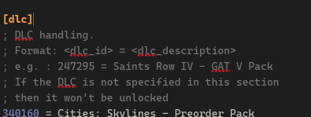
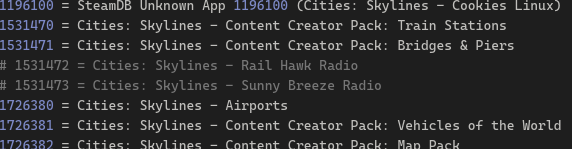

本文主要介绍如何自定义都市天际线的 CreamAPI 补丁来自定义 DLC.
<!-- more -->

本教程基于 QQ 群 143395035 (下简称Q群) 中打包的 DLC 补丁，即`群文件/关于DLC/Steam版天际线DLC补丁 2024.10.24.7z`。

::: warning
由于Q群和我都主要是 Steam 平台，因此本教程不面向 EPIC 版游戏。
:::

::: caution
阅读前请确保你已经**正确安装**了 DLC 补丁！
:::

打开游戏目录：

在游戏主页点击`管理`，然后移到`管理`，在弹出菜单中选择`浏览本地文件`：

> Linux 需要在打开的文件管理器中依次进入 `Cities_Data/Plugins/x86_64`。

打开 `cream_api.ini`。

> Windows 系统记得打开文件后缀名。

下滑，找到 `[dlc]` 小节。

自介绍文段后的 `ID = Label` 列表就是我们需要修改的。其中 `Label` 是对应 DLC 的名字。

找出你不想要的 DLC，在最前面加 `;` 或 `#` 将其注释。本示例关闭了 `Rail Hawk Radio` 和 `Sunny Breeze Radio`。

::: tip
一定要用半角符号注释。如果你不确定，请复制这个 `#`。
:::

修改完成后，保存并重新进入游戏。此时不想要的 DLC 已经被关闭。