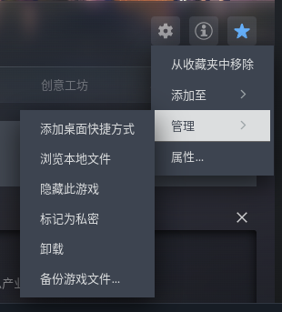
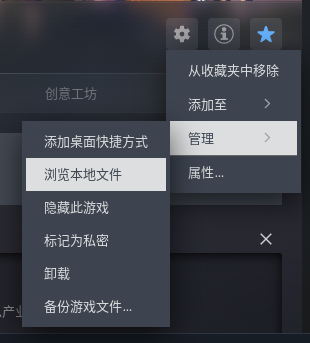
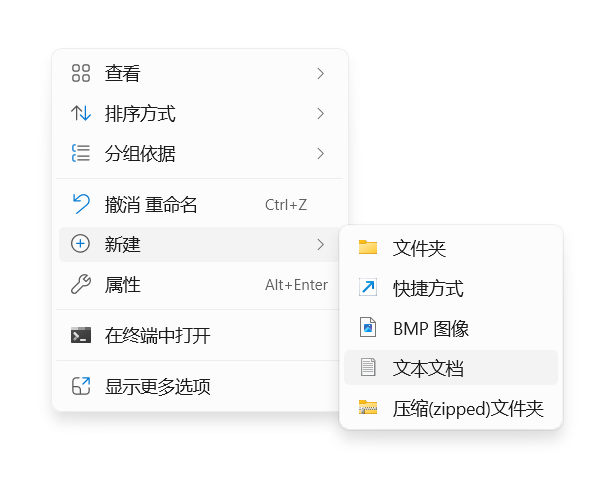
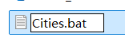
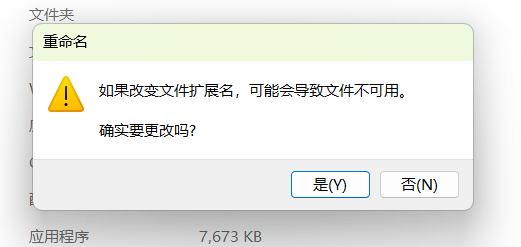
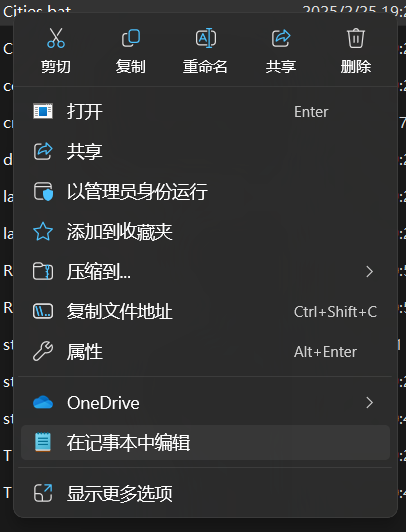
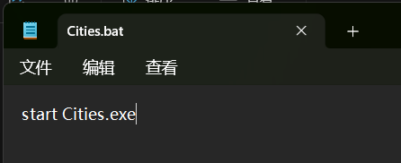

本教程教你如何跳过恼人的 Paradox Launcher。

::: warning
本教程不面向 EPIC。
:::

<!-- more -->

打开游戏目录：

在游戏主页点击`管理`>`管理`>`浏览本地文件`：





右键文件夹，选择“新建”>“文本文档”



将新文件命名为 `Cities.bat`：



若弹出警告提示，选择“是”：



右键点击 `Cities.bat`，选择“在记事本中编辑”：



写入以下内容：

```bat
start Cities.exe
```

::: tip
将鼠标移到上方文本块后将提供**复制**按钮(在原来右侧`bat`文字下方)，可直接复制粘贴。下文同。
:::



保存，然后返回 Steam。

进入`管理`>`属性`>`启动选项`，输入以下内容：

```bat
Cities.bat %command%
```


写入完成后关闭窗口，然后启动游戏。此时应当直接进入游戏主菜单。