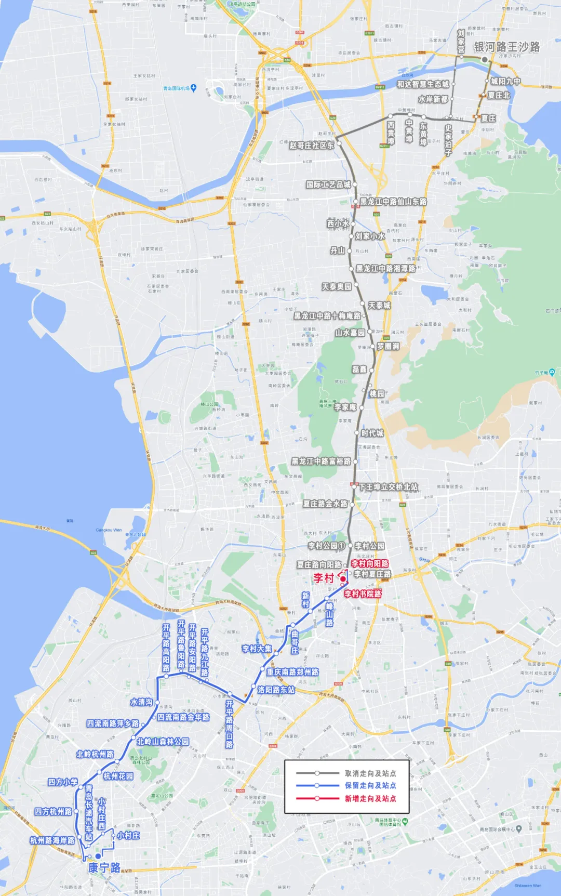

关于公交集团计划将371路公交车由**康宁路——银河路王沙路**截短至**康宁路——李村**的短评。

城运原文：[微信公众号](https://mp.weixin.qq.com/s?__biz=Mzk0MTIwNTY0MQ==&mid=2247600461&idx=1&sn=84550394852c8bcc6b39ea6b82ab331f&chksm=c34c5b7f07054d47c8fd5d9b6c23797c6ecf26c8e1c2bfc9ebe54a2dd0f6d435e8f87cf7398f&mpshare=1&scene=23&srcid=02271cAgGyTche2dHSr8HDHy&sharer_shareinfo=c347c4daf2575fe3acb9a9a71a7e70ae&sharer_shareinfo_first=c347c4daf2575fe3acb9a9a71a7e70ae#rd) [官网投票](http://qdcykg.net/xlghDetails?newsId=1895022534852743168&newsType=xlgh&pageId=page_ozlzzr7or)

<!--more-->

371路原为**昌乐路——仰口**，经多次截线（**昌乐路——盛世美域西**，**康宁路——盛世美域西**，**康宁路——银河路王沙路**）后成功保留了市北——李村以及李村——夏庄的主要客流。此后很长一段时间371路除了抽换配车之外没有什么大改变。

2025年2月27日，公交集团计划将371路截短至**李村**，这可以说是自开年来城运一堆抽象调整规划中最为狗屎的几个之一。

事实上，371路的主要客流走廊就是由城阳夏庄通向李沧的黑龙江路，城运今天的修改是及其不切实际的。
假设371路真的截线了，那么可以预见到：在不久的将来，城运以“与地铁重合，沿线其他公交线路数量多”的名义，将这条在青岛市内运行了十数年的老线停运，顺便抽出几台小车补充越来越空虚的车库。

看时刻表，将末车延后到20:40，实际上并没有什么用处，因为四方——李村公园在这个时间段仍然有大把配属新车的公交线路提供服务；首车早发40分钟，其实可以算是给点多了，毕竟从李村——白沙河的路段可远不止40分钟。

配车数量也直接减少6部，可以说是这次调整的关键点。很明显公交集团现在是真没车跑了，这些Q7本来可以在371路上慢悠悠摇到退役，现在却不知道又要调到哪条线路上拉货。

建议直接将371路移交给城阳巴士三公司或八公司运营，将主副站调整为前（后）金——康宁路（或青岛长途汽车站），毕竟相对于市内这些拿着新买的宝宝巴士拆东墙补西墙勉强度日的分公司来说，城阳巴士显然是不缺大车的（七公司，你说对吧）。